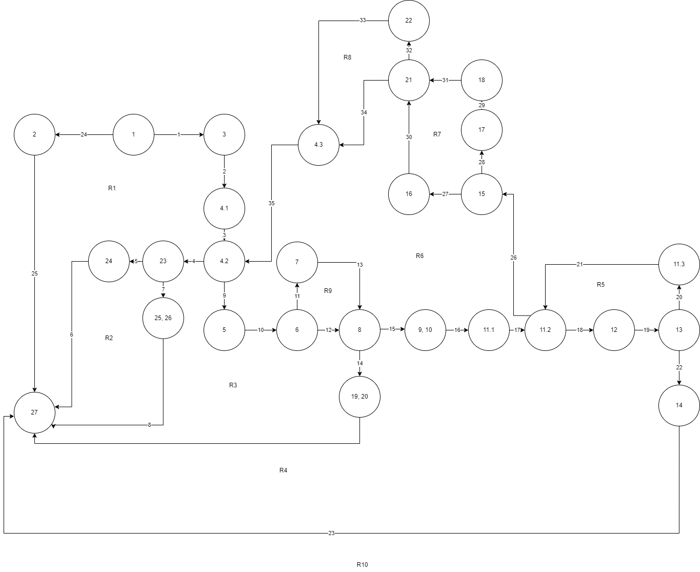
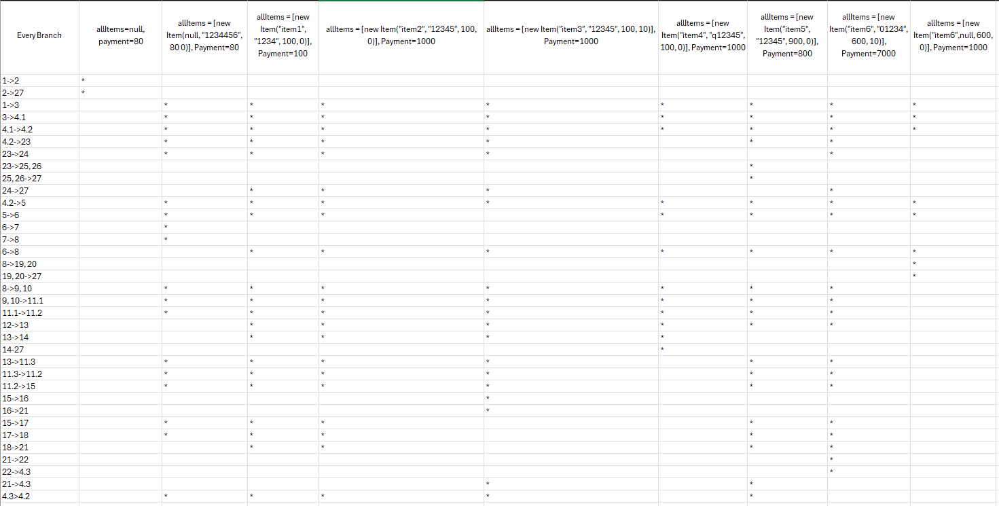

# Втора лабораториска вежба по Софтверско инженерство

## Дарко Кузманоски, бр. на индекс 213153

### Control Flow Graph

### Цикломатска Комплексност(CFG)
Nodes=27
Edges=35
Regions=10

CFG = 35 - 27 + 2 = 10
     (E)  (N)
Според формулите за пронаоѓање на Цикломатската Комплексност може да се увиди дека таа изнесува 10,
односно 35-27+2=10, како и според бројот на региони каде што вредностата е иста.

### Тест случаи според критериумот Every Branch
Со наведените тест случаи е обезбедено да се опфатат сите излези на програмата, односно истото е 
постигнато со 9 тест примери кои што се дообјаснати во продолжение:

allItems=null, payment = 80
Доколку функцијата прима null како низа и било што за payment програмата се извршува преку чекорите
1-2 и 2-27 каде што се фрла исклучок бидејки не постои низа, со што се опфатени првите чекори.

allItems = [new Item(null, "1234456", 80 0)], Payment=80
Тест случај каде што се проверува условот за доколку пости име на елементот со што се како име се
поставува "unknown".

allItems = [new Item("item1", "1234", 100, 0)], Payment=100
Тест случај каде што елементот има име, како и сума помала или еднаква на плаќањето

allItems = [new Item("item2", "12345", 100, 0)], Payment=1000
Тест случај со валиден баркод и без попуст

allItems = [new Item("item3", "12345", 100, 10)], Payment=1000
Тест случај за валиден баркод и попуст

allItems = [new Item("item4", "q12345", 100, 0)], Payment=1000
Тест случај за невалиден баркод, каде што се тестира условот во баркодот да нема карактери при што
програмата за излез приложува исклучок и завршува со извршување.

allItems = [new Item("item5", "12345", 900, 0)], Payment=800
Тест случај каде што сумата е со поголема вредност во однос на плаќањето

allItems = [new Item("item6", "01234", 600, 10)], Payment=7000
Тест случај каде што важи условот цената да е поголема од 300, попустот поголем од 10 како и баркодот
да започнува со 0

allItems = [new Item("item6",null, 600, 0)], Payment=1000
Тест случај каде што се тестира функцијата без баркод, со што програмата фрла соодветен исклучок и
прекинува со извршување.

Со овие 9 теста се опфатени сите случаи, изминати сите јазли и рабови. 

### Тест случаи според критериумот Multiple Condition
За оваа функција максимални тест случаи кои што би можеле да се имплементираат се 8 иако нема потреба
од сите бидејќи функцијата се состои од && оператори со што резултира со паѓање на функцијата доколку
еден услов не помини, односно биде неточен(False).

allItems = [new Item("item1", "01234", 600, 10)], Payment=7000
Во овој тест случај сите три дела поминуваат како вистините со што програмата влегува и го извршува
условот.

allItems = [new Item("item2", "1234", 600, 10)], Payment=7000
Условот не поминува бидејќи третиот дел не е точен, односно баркодот не започнува со 0

allItems = [new Item("item3", "01234", 600, 0)], Payment=7000
Тест случајот тестира доколку попустот не е поголем од 0, а другите два случаи се висинити.

allItems = [new Item("item4", "1234", 600, 0)], Payment=7000
Во овој тест случај точен излегува само условот за цената да е поголема од 300, но не и другите два
случаи

allItems = [new Item("item5", "01234", 200, 10)], Payment=7000
Во овој тест случај не точен е само првиот услов цената да е поголема од 300, додека останатите два
се вистинити.

allItems = [new Item("item6", "1234", 200, 10)], Payment=7000
Во овој случај не точен е првиот услов цената да е поголема од 300, точен е условот за попустот да
изнесува вредност поголема од 10 и не точен е условот баркодот да започнува со 0.

allItems = [new Item("item7", "01234", 200, 0)], Payment=7000
Првите два услови се неточни, цената да е поголема од 300 и попустот да е поголем од 10, спротивно
како точен е условот каде што се проверува дали баркодот започнува со 0

allItems = [new Item("item8", "1234", 200, 0)], Payment=7000
Последниот случај резултира со сите неточни, меѓутоа престанува да се извршува уште при првиот услов,
односно цената да е поголема од 300.

### Објаснување на unit тестови
everyBranchTest
Првиот тест во everyBranchTest се однесува на тестирање за null во allItems при што доколку низата
е null програмата фрла исклучок со порака ,,allItems list can't be null".

Null item name
Проверува дали методот враќа true кога некој елемент е со null име, но сепак со валиден баркод и цена.

Non null item name и сума пониска од плаќање
Осигурува дали методот враќа true кога некој елемент со валидно име, баркод и цената за плаќање се присутни

Valid barcode и no discount
Потврдува дека методот враќа true за елемент со валиден баркод, без попуст и доволна исплата.

Valid barcodе и discount
Валидира дека методот ќе врати true за елемент со валиден баркод, попуст и доволна исплата.

Invalid barcode
Проверува дали методот дава исклучок со порака ,,Invalid characted in item barcode!" кога елементот
има невалиден баркод, односно нешто повеќе од цифри.

Total price grater than payment
Обезбедува методот да врати false кога тоталната сума на елементите го надминува лимитот за плаќање.

Price bigger than 300, discoung bigger than 10, barcode starting with '0'
Потврдува доколку методот ги исполнува сите овие услови при што враќа true.

Missing barcode
Проверува дали постои баркодот, доколку не исфрла исклучок со порака ,,No barcode!" кога баркодот
недостасува.

secondTestConditions
High price, discount, barcode starting with '0'
Доколку методот ги исполнува сите овие услови, програмата враќа true.

High price, discount, barcode not starting with '0'
Методот при оваа порака враќа true доколку последниот израз, односно баркодот не запонува со 0. 

High price, no discount, barcode starting with '0'
Во овој тест се враќа true кога попустот изнесува помалку од 10.

High price, no discount, barcode not starting with '0'
Во овој дел тестот ќе врати true доколку попустот е со вредност помала од 10 и баркодот не започнува со
0

Low price, discount, barcode starting with '0'
Методот враќа true кога имаме ниска цена, попуст, и баркодот започнува со 0.

Low price, discount, barcode not starting with '0'
Ниска цена, попуст и баркод не започнува на 0 се услови при кои овај тест би вратил true.

Low price, no discount, barcode starting with '0'
Овој тест ќе врати true кога имаме ниска цена, без попуст и баркод со почетна 0.

Low price, no discount, barcode not starting with '0'
И последниот тест е кога сите се обратни во однос на условот и тестот ќе врати true.
